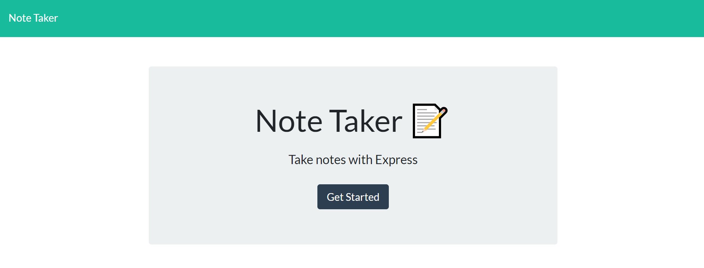
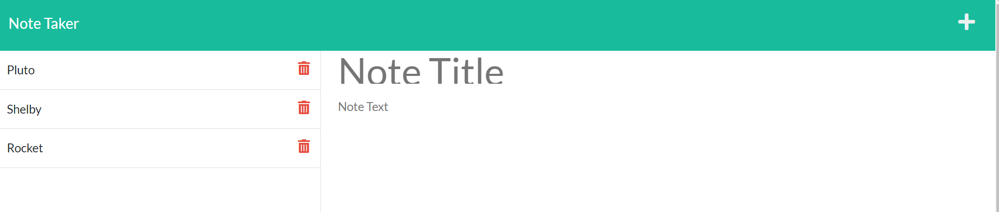

# Note Taker  

  ## Description 
  This program allows a user to keep track of thoughts and organize information be writing, saving and deleting notes. 
  
  - The navigation page allows the user to click a button to access a list of all their previous notes and create new ones at the click of a button. 
  - Uses JSON to store notes and express JS to serve them to the server.    

  ## Table of Contents 
  - [Installation](#Installation)
  - [Usage](#Usage)
  - [Contributing](#contributing)
  - [Screenshots](#screenshots)

  ## Installation 
  - https://github.com/bekkahhuss/note-taker
  - Download repo from github and open in your code editor 
  - Open an integrated terminal and run the program with    the command "npm start" and local server. 
  - The deployed version is also available here: https://still-ocean-46960.herokuapp.com/

  ## Usage 
  - From the home page click "Get Started" to navigate to notes. 
  -  Create a new note by adding a title and text in the provided spaces. Then click the save icon in the header. 
  -  Notes can be deleted by hitting the trashcan icon. 
 
  ## Contributing
  - Rebekkah Huss [Github Link](https://github.com/bekkahhuss)

  ## Screenshots 
    

    

